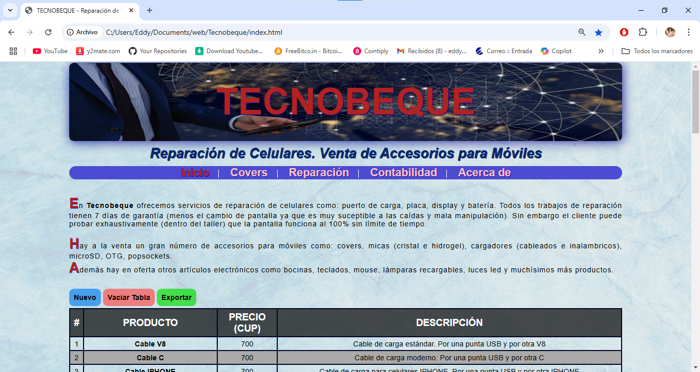
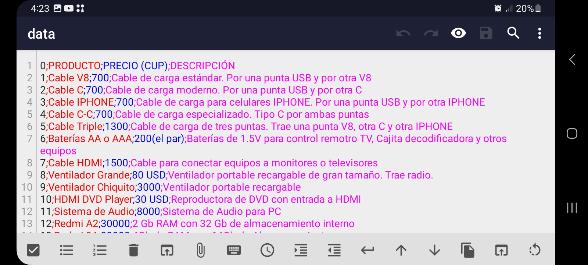
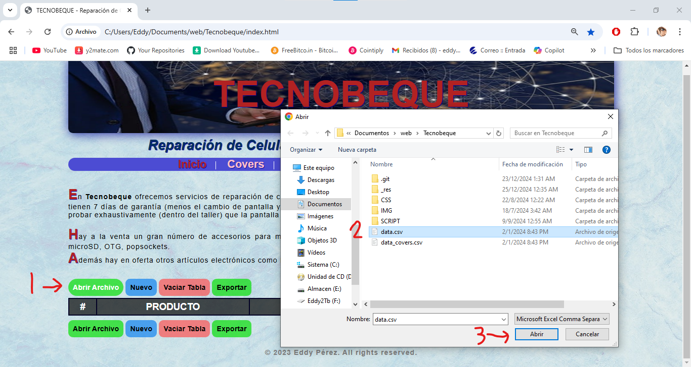
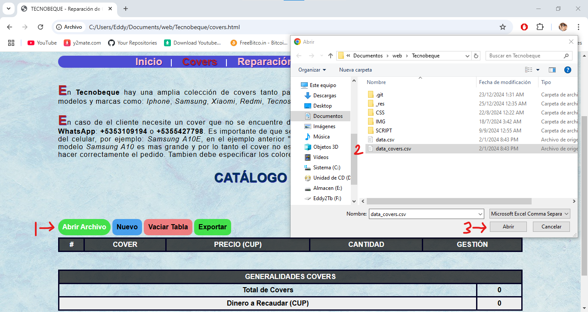

# TECNOBEQUE 
## Tienda de tecnología y taller de reparación   de celulares

La aplicación utiliza código legible utilizando las ventajas y nuevas etiquetas que ofrece HTML5: `<nav>,  <section>,  <header>,  <footer>`

Los datos se visualizan a través de `<table>` y se almacenan de manera local y offline. 
Se utilizan simultáneamente dos estrategias de almacenamiento: 
- **Local Storage** (para la interacción directa con el usuario a través de hacer CRUD sobre `<table>`).

- **Ficheros de texto con formato CSV** (los datos persisten en el tiempo y permiten ser cargados en cualquier navegador).

###   LOCAL STORAGE
Es una _API_ de _Javascript_ que permite almacenar datos de manera permanente y local al navegador donde se ejecuta. 
La aplicación utiliza el _local storage_ para agregar, leer, modificar y eliminar productos en oferta.

Un producto se almacena en el local storage como una dupla **key - value**, pudiendo acceder a la información de manera simple:

> let value = localStorage[key];

O de igual manera es válido

> let value = localStorage.getItem(key);

###  FICHEROS DE TEXTO CSV

Estructura del fichero _data.csv_ 

Cada línea representa un producto y cada producto cuenta con: #, Nombre, Precio, Descripción. Cada una de las carácteristicas del producto se separa por **";"**.

Al abrir la aplicación por primera vez es necesario cargar los ficheros **data.csv** y **data_covers.csv** para cargar los datos de las páginas **index.html** y **covers.html** respectivamente.

Cargar fichero _**data.csv**_ en _**index.html**_

Cargar fichero _**data_covers.csv**_ en _**covers.html**_
